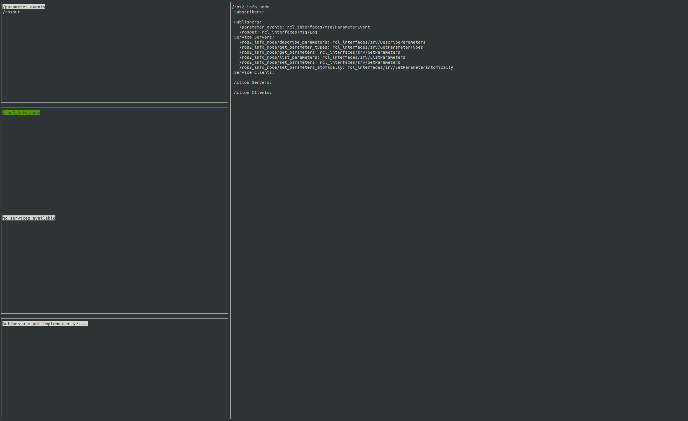

# rosgui
A curses command line gui for ros2



# System
- Ubuntu 20.04 (others untested)
- Ros2 Humble

# Description

## Rosgui - the application
You can install the `rosgui` application to 

## Rosgui - the idea
This repository has building blocks for rapidly mocking up a command line GUI.

As much as possible, the tools for rapidly creating your own gui have been exposed.
See demo_gui for some ideas on how to use this for your own content. 

# Install - Currently broken!!! 
```
~~git clone https://github.com/AspenEyers/rosgui.git~~
~~cd rosgui~~
~~pip install .~~
```

